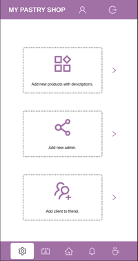
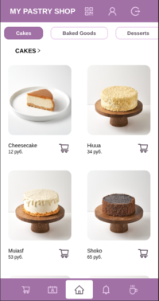
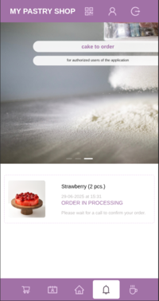
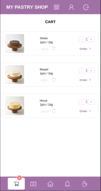
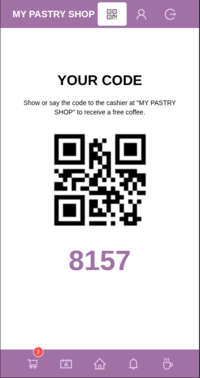

# 🍰 Pastry Shop Automation System

This project will provide you with a complete automation system for your pastry shop.

[](https://reactjs.org/)
[](https://www.typescriptlang.org/)
[](https://nodejs.org/)
[](https://www.postgresql.org/)
[](https://www.docker.com/get-started/)

## Features

- Docker allows you to build a system with a single command
- Full-fledged fullstack project
- Real business processes are automated

## Tech Stack

### Frontend


### UI Libraries


### Backend


### Databases & Architecture


## Implemented functions

### Authentication system
- 📧 Registration with email confirmation
- 🔑 JWT authorization
- 👨‍💼 Separation of roles (client/admin)

### Admin panel
- 🧑‍🤝‍🧑 User management (friends/admins)
- 🍪 CRUD for products
- 🎁 Generate QR codes for bonus coffees
- 📊 Order management



### Client panel
- 🛒 Shopping cart with order processing
- 🎫 Discount program "Friend of the pastry-shop"
- 📱 QR codes for bonuses
- ⏱ Order status tracking

   

## Quick Start with Docker

This project can be set up with a single Docker command. Follow these simple steps to get the Pastry Shop Automation System up and running.

### Prerequisites

Install [Docker Desktop](https://www.docker.com/get-started/). This includes both Docker and Docker Compose

- [Installation guide for Windows/Mac](https://docs.docker.com/desktop/)

- For Linux (Ubuntu/Debian):

    ```bash
    sudo apt-get update && sudo apt-get install docker-ce docker-ce-cli containerd.io docker-compose-plugin
    ```
- Verify installation:

    ```bash
    docker --version && docker compose version
    ```
    
Clone the repository (if you haven't already)

```bash
https://github.com/Thayorns/pastry-shop.git
cd pastry-shop
```

Configure Environment Variables. The project requires `.env*` files in these locations:

- Roor folder (main settings)

- `client/` (frontend variables)

- `server/` (backend variables)

How to set up

- For each folder (root, `client`, `server`) :
    
    - Find the `example.env` file
    - Create a copy named `.env*`:

        ```
        cp example.env .env                              # for root folder
        cp example.env.development .env.development      # for client and server folders
        cp example.env.production .env.production        # for client and server folders
        ```
- Open each `.env*` file in a text editor and fill in the required values if needed (API keys, database credentials, etc.)

- Save the files — they will be automatically ignored by Git

*Note: Never commit `.env*` files to version control!*

---
### Running the project

In development mode:

-  make changes to `/server/mailer.js`, `/server/index.js` as indicated in the comments in these files to get all backend functionality. (*optional*)

- run docker command:

    ```bash
    docker-compose -f docker-compose.dev.yml up --build
    ```

- open `http://localhost:3000` url in browser

In production mode:

- make changes to `/client/nginx.conf`, `/client/certbot.sh`, `/server/mailer.js`, `/server/index.js` as indicated in the comments in these files. (*required*)

- run docker command:

    ```bash
    docker-compose up --build
    ```
---

⭐ **If you liked the project, give it a star!** ⭐